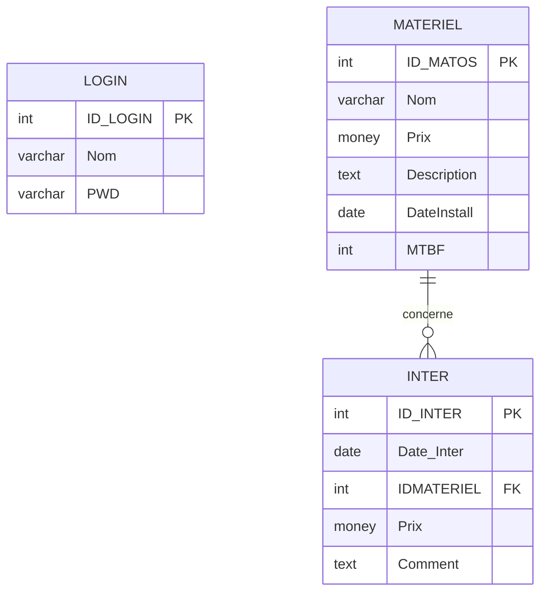

# Modélisation de la base FixInfo

Ce document présente le MCD simplifié, le MLD et le MPD de l'application FixInfo.

## MCD simplifié

### Entités

**Login**

- ID_LOGIN
- Nom
- PWD

**Materiel**

- ID_MATOS
- Nom
- Prix
- Description
- DateInstall
- MTBF

**Intervention**

- ID_INTER
- Date_Inter
- Prix
- Comment

### Association

- Un matériel peut avoir zéro, une ou plusieurs interventions.
- Une intervention concerne un seul matériel.



## MLD

```text
Login(
  ID_LOGIN,
  Nom,
  PWD
)

Materiel(
  ID_MATOS,
  Nom,
  Prix,
  Description,
  DateInstall,
  MTBF
)

Inter(
  ID_INTER,
  Date_Inter,
  #IDMATERIEL,
  Prix,
  Comment
)
```

`#IDMATERIEL` est une clé étrangère vers `Materiel(ID_MATOS)`.

## MPD

```text
Login
- ID_LOGIN int identity primary key
- Nom varchar(50) not null
- PWD varchar(100) not null

Materiel
- ID_MATOS int identity primary key
- Nom varchar(50) not null
- Prix money not null
- Description text null
- DateInstall date not null
- MTBF int not null

Inter
- ID_INTER int identity primary key
- Date_Inter date not null
- IDMATERIEL int not null
- Prix money not null
- Comment text null
- FK_Inter_Materiel : IDMATERIEL references Materiel(ID_MATOS)
```

Le script SQL complet est disponible dans le fichier [FixInfo.sql](../FixInfo.sql).
